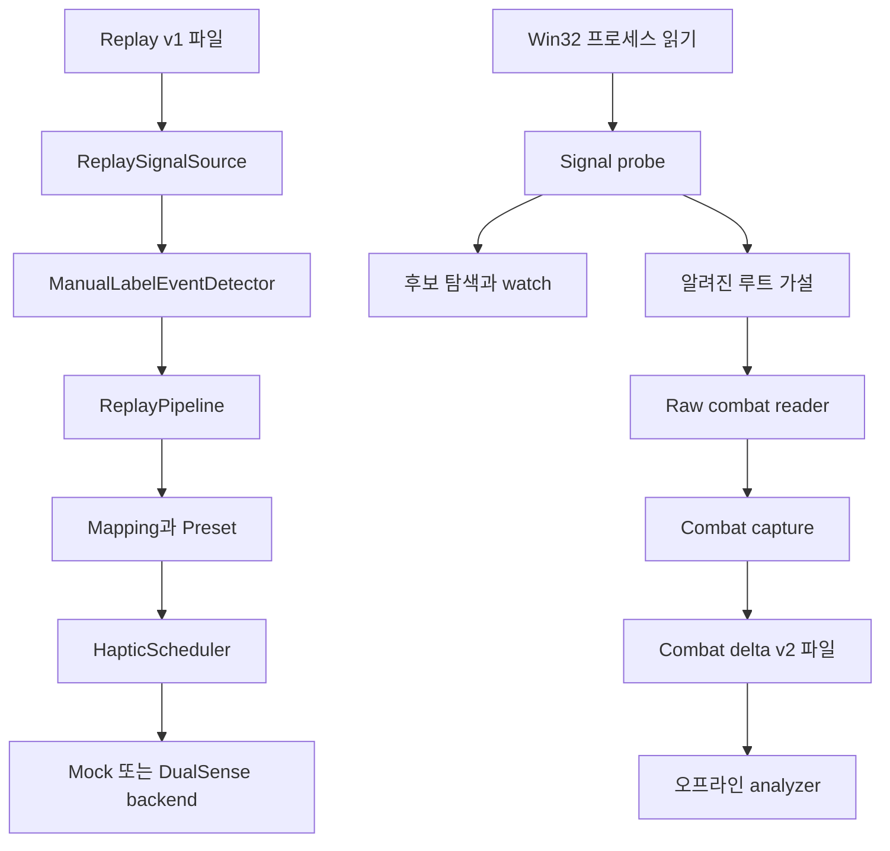
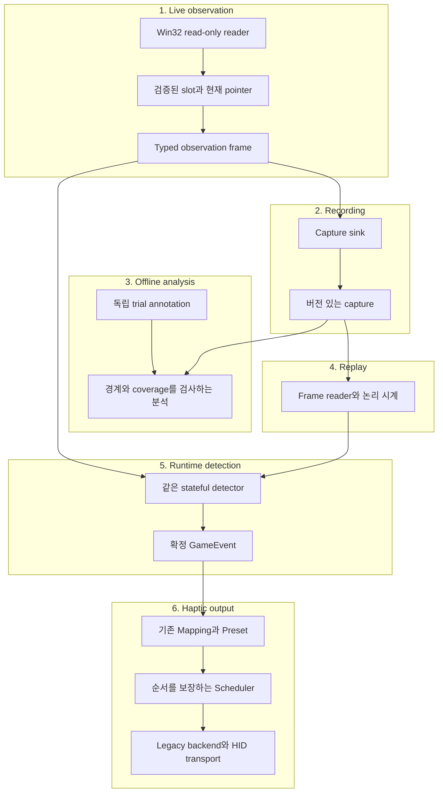

# SekiroHaptics 독립 아키텍처 감사

감사일: 2026-09-09 · 대상: 사용자가 올린 sekiro_haptics(1).zip의 작업 트리 · 방식: 소스 수정 없는 감사

## 1. Executive verdict

**판정: B — 핵심을 유지하고, 관측·캡처·분석의 일부를 재설계한 다음 진행한다.**

이 저장소에는 재사용할 가치가 있는 출력 파이프라인과 테스트 가능한 읽기 전용 프로세스 접근 기반이 있다. 그러나 실제 Sekiro 관측을 실제 전투 이벤트로 바꾸는 연결은 아직 없다. 더 심각한 문제는 다음 실험의 근거가 될 캡처가 객체 교체를 잘못 처리하고, 기존 파일을 덮어쓰며, 원래 관측을 충분히 재현하지 못한다는 점이다. 분석기는 불완전한 관측을 높은 지지율과 낮은 오탐률처럼 표시할 수 있다.

따라서 A는 부적절하다. 현재 상태로 전투 데이터를 더 쌓으면 잘못된 근거 위에서 검출기를 만들 위험이 있다. C도 과하다. Mapping, Preset, Replay의 논리 경로, AOB/RIP 계산, 작은 프로세스 인터페이스, Legacy rumble 출력은 통째로 버릴 이유가 없다.

이번 감사에서 확인한 핵심은 다음과 같다.

- **공통 코드 테스트 494개는 모두 통과했다.** Linux 전용 5개까지 포함한 실행 결과는 496/499다. 실패 3개에는 이 환경의 프로세스 읽기 제한이라는 구체적 제약이 있다. Windows 빌드·실제 Sekiro·DualSense 장치는 검증하지 못했다.
- **감사용 재현 10건**으로 오래된 객체 읽기, 세대 간 잘못된 델타, 재시작 덮어쓰기, 관측 손실, 분석 편향, Replay 정보 손실, Reset 이후 전송을 확인했다. 이것들은 새로 통과한 제품 테스트 10개가 아니라 현재 동작의 재현 증거다.
- 실행 파일 크기와 SHA-256에는 **동봉된 세션 로그라는 출처가 있다.** 반면 AOB가 의도한 루트를 찾는지, HP/체간 오프셋이 실제 필드인지, 막기와 튕겨내기를 구분할 수 있는지는 확인되지 않았다.
- 실제 후보 watch 기록은 있지만, **레이블이 있는 실제 전투 캡처와 실제 전투 검출기는 없다.** ManualLabelEventDetector가 사람의 정답을 이벤트로 바꾸는 것은 검출 성능의 증거가 아니다.
- 먼저 고칠 대상은 전체 폴더 구조가 아니라 **관측의 생명주기, 기록 보존, 재현 가능성**이다. Scheduler의 Reset 순서는 실제 출력 연결 전에 고친다.

증거 수준은 일관되게 구분한다. **코드 확인**은 구현과 호출 관계, **재현 확인**은 합성 입력에서 실행한 동작, **동봉 기록**은 첨부된 과거 실행 산출물, **미검증**은 이 감사에서 게임이나 장치로 확인하지 못한 사실을 뜻한다.

## 2. Ground-truth architecture

### 2.1 감사한 버전과 범위

Git HEAD는 e80de4065a48fb961d186192355a72515877e24b, 브랜치는 feature/sekiro-probe-disk-backed다. HEAD는 2026-09-06의 Stage C 캡처 커밋이고, 같은 날 0ce2371에서 알려진 루트와 raw combat reader가 들어왔다. **감사 대상은 HEAD만이 아니라 ZIP에 포함된 미커밋 작업까지 포함한 상태다.**

줄바꿈 차이를 제외하면 추적 파일 14개에 의미 있는 변경이 있고, debounce·rising edge 유틸리티 및 통합 테스트를 포함한 신규 파일 5개가 있다. 추출한 비 Git 파일 232개의 SHA-256을 기록했고 감사 중 변경된 파일은 없다. ZIP의 빌드 산출물과 대용량 scanner binary 데이터는 실행·분석 대상에서 제외했다. 전체 비압축 크기는 약 8.37 GB이며, 그 바이너리 전체를 검증했다고 주장하지 않는다.

중심 빌드 정의인 [CMakeLists.txt](sandbox:/workspace/scratch/d7e4abee2739/sekiro_haptics_audit/source/CMakeLists.txt)에는 공통 정적 라이브러리의 C++ 구현 파일 43개가 들어 있다. Windows 프로세스 구현 3개와 HIDAPI transport는 별도 target이다. HIDAPI는 0.15.0 태그를 사용한다.

| 분류 | 실제 구성 | 현재 역할과 연결 |
|---|---|---|
| 제품 런타임으로 재사용 가능한 코드 | GameEvent, MappingRepository, PresetRepository, HapticScheduler, HapticEffect | 이벤트 이후 출력 처리. 실제 게임 검출기와는 아직 연결되지 않음 |
| Replay 실행 경로 | ReplaySignalSource, TraceReader, ManualLabelEventDetector, ReplayPipeline | 파일의 신호 → 수동 레이블 기반 이벤트 → 매핑 → 프리셋 → 큐 |
| 저수준 재사용 코드 | IProcessReader, IProcessInspector, IProcessMemoryMap, ExecutableIdentity, AobScanner, RipRelative, AddressResolver | OS 접근을 분리하고 모듈·빌드·주소 계산을 검증 |
| 개발용 발견 도구 | CandidateScanner, DiskCandidateScanner, CandidateStorage, ScanManifest, DiscoverySession, SignalProbeScanController | 후보 탐색, 디스크 상태, watch 기록. 제품 이벤트 루프에 불필요 |
| Sekiro 실험 코드 | SekiroKnownRootResolver, SekiroRawCombatReader, CombatCaptureSession/Controller/CommandProcessor | 하드코딩된 가설을 시험하고 메모리 변화와 marker를 기록 |
| 오프라인 분석 | SekiroCombatCaptureAnalyzer | marker 주변의 offset 변화를 집계. 런타임 검출기 아님 |
| 하드웨어 코드 | DualSenseUsbReport, DualSenseLegacyBackend, HidApiDualSenseTransport | USB legacy rumble 보고서 생성과 실제 HID 쓰기 경로 |
| 테스트 전용 | Fake reader/inspector/transport, helper process, Linux reader, fixture, 작은 테스트 러너 | 합성 메모리·출력 및 제한된 OS 통합 검증 |

현재 앱은 console_test, replay_cli, replay_hardware, dualsense_rumble_test, sekiro_signal_probe의 다섯 종류다. console_test와 rumble_test는 출력 확인용이고, sekiro_signal_probe는 Windows 개발 도구다. 테스트 helper 실행 파일을 별도 제품 앱으로 세면 안 된다.

### 2.2 실제 호출 경로

Replay 경로는 [ReplayPipeline.cpp](sandbox:/workspace/scratch/d7e4abee2739/sekiro_haptics_audit/source/src/pipeline/ReplayPipeline.cpp)의 ProcessSignal → detector.OnSignal → ResolveAndDispatch → mappings.Find → presets.Find → scheduler.Schedule이다. Scheduler worker가 backend.SendEffect를 호출한다. 설정과 앱 선택에 따라 Mock 또는 실제 Legacy backend로 이어진다.

Probe 경로는 [sekiro_signal_probe/main.cpp](sandbox:/workspace/scratch/d7e4abee2739/sekiro_haptics_audit/source/apps/sekiro_signal_probe/main.cpp)에서 Win32 reader를 구성하고, identity 확인·루트 해석·raw reader·capture controller를 호출하는 별도 흐름이다. combat-export는 캡처 경로를 알려줄 뿐 ReplaySignalSource로 변환하지 않는다.

두 흐름을 잇는 간선이 없는 것이 현재 상태다. 클래스 이름에 Signal, Combat, Event가 있다고 연결된 것으로 보지 않았다.

### 2.3 인계 주장 검증

| 기존 주장 | 독립 확인 결과 |
|---|---|
| 출력 쪽이 검출 쪽보다 완성도가 높음 | 맞음. 실제 backend와 전송 구현이 있고, 실제 관측 기반 detector는 없음 |
| Replay → Mapping → Preset → Scheduler → Backend 연결 | 맞음. 단, Dispatched는 큐 등록이며 실제 HID 성공 통지가 아님 |
| 프로세스 접근과 발견 인프라가 성숙함 | 알고리즘과 Fake 테스트는 상당함. Windows 권한 계약, 현재 probe 생명주기, 실게임 데이터 품질까지 성숙하다고 확대할 수 없음 |
| LiveSekiroSignalSource와 실제 검출기가 없음 | 맞음. RawCombatReader와 capture는 그 대체물이 아님 |
| 실행 파일 지문과 AOB·필드 가설이 있음 | 맞음. 지문에는 동봉 로그가 있고, 필드 의미·AOB 루트 의미는 미검증 |
| GameSignal은 문자열 중심, CombatSnapshot은 typed | 맞음. 다만 후자도 원본 관측·시간·객체 정체성을 충분히 보존하지 않음 |
| 발견 코드가 공통 라이브러리에 들어 있음 | 맞음. 정적 라이브러리이므로 모든 object가 모든 실행 파일에 링크된다는 의미는 아님 |
| 대략 603개 테스트 | 소스 선언 수로는 맞음. 플랫폼별로 상호 배타적인 테스트를 합한 수이며 단일 실행 결과가 아님 |
| 문서에 실제 Sekiro 값이 없다고 쓰여 있음 | 일부 README·문서 설명이 현재 소스와 모순. 참조된 docs/07-combat-signal-reader.md도 없음 |

## 3. Actual critical path

제품 목표는 “실제 Perfect Deflect 발생 → 관측 → 검출 → 의도한 DualSense 진동”이다. 가장 짧은 의존 관계를 아래처럼 평가한다. DONE AND PROVEN은 해당 행에 적힌 범위에서만 사용한다.

| 단계 | 분류 | 확보한 증거 / 부족한 증거 |
|---|---|---|
| 정확한 빌드 식별과 읽기 전용 attach | IMPLEMENTED BUT NOT PROVEN | 코드와 세션 지문은 있음. 현재 Windows 실행 및 API 권한 계약 확인 필요 |
| 올바른 player 관측 위치를 안정적으로 찾음 | PROTOTYPE | AOB·RIP·포인터 가설 있음. 실제 hit와 필드 의미 증거 없음 |
| 읽기 성공·객체 교체·시간 공백을 보존한 관측 | PROTOTYPE | typed snapshot과 delta capture 있음. R1–R4로 무결성 결함 확인 |
| 관측으로 Normal Block / Perfect Deflect / Take Damage를 구분 | MISSING | 사람 레이블을 제외한 실제 detector 없음. 분리 가능한 feature도 아직 증명 안 됨 |
| live와 replay가 같은 관측으로 같은 detector를 실행 | MISSING | combat 파일과 기존 replay 형식이 다르고 adapter 없음 |
| 의미 있는 GameEvent를 생성 | TEST-ONLY | ManualLabelEventDetector와 합성 fixture로 이벤트 경로를 시험 |
| Event → Mapping → Preset 선택 | DONE AND PROVEN | 공통 테스트의 논리 계약 범위. 실제 게임 이벤트 의미의 증거는 아님 |
| Preset → Scheduler 큐·duration·backend 호출 | IMPLEMENTED BUT NOT PROVEN | 일반 동작 테스트 통과. Reset 순서 결함 재현, 실시간 지연 미측정 |
| DualSense USB 보고서 생성 | DONE AND PROVEN | byte layout 및 Fake transport 기반 테스트 범위 |
| HID 전송 → 실제 컨트롤러의 의도한 진동 | IMPLEMENTED BUT NOT PROVEN | 실제 구현 있음. 이 감사에서 장치 검증 없음 |
| 이 전체 경로의 오탐·재현율·지연 | MISSING | 실제 end-to-end 측정 자료 없음 |
| 대규모 디스크 후보 scanner·범용 플랫폼·PCM | POSSIBLY UNNECESSARY | 첫 이벤트의 필수 의존성이 아님. 필요가 입증될 때 다시 사용 |

지금 가장 큰 병목은 출력 확장이 아니라 **믿을 수 있는 관측과 이벤트 분리 가능성의 증거**다. Replay는 제품 실행에 꼭 필요한 것은 아니지만, 이 증거를 반복 검증하고 회귀를 막는 가장 유용한 개발 경로다.

지연은 다음 항목을 분리해야 한다.

> 게임 상태가 관측 가능해지는 지연 + 다음 성공한 읽기까지의 대기 + 읽기 시간 + 검출 확인 시간 + Scheduler 대기 + HID 전송 + 장치 반응.

5 ms 설정은 정상적인 주기와 충분히 오래 유지되는 상태에서 샘플링 위상 지연을 작게 만들려는 목표다. 현재 코드에는 **최악 지연의 유한한 상한을 보장할 근거가 없다.** 읽기 실패, mutex 경합, 파일 쓰기, OS scheduling, 검출 확인 창이 추가된다. 상태가 실제 성공한 읽기 간격보다 짧으면 통째로 놓칠 수 있다. Sleep 호출 이후에도 즉시 실행된다는 보장은 없다. [Microsoft Sleep 문서](https://learn.microsoft.com/en-us/windows/win32/api/synchapi/nf-synchapi-sleep)

analyzer의 기본 200 ms 창은 아직 존재하지 않는 제품 detector의 필수 지연이 아니다. “event → queue <20 ms”는 게임 발생부터 손에 느끼기까지의 지연과도 다르다. 각각의 시작·종료 시각을 따로 측정해야 한다.

## 4. Major architectural strengths

**관측, 의미, 감각을 나누는 개념은 맞다.** HP 값과 Perfect Deflect라는 판단, 그리고 좌우 모터의 출력은 서로 다른 책임이다. 새 이벤트마다 HapticEffect enum을 늘리지 않고 eventId → presetId로 매핑할 수 있는 현재 구조를 유지한다.

**출력 쪽의 분리는 실제 비용을 줄인다.** IHapticBackend와 IDualSenseTransport 덕분에 의미 있는 effect와 USB byte layout, OS HID 연결을 따로 검증할 수 있다. Legacy backend가 실제로 있으므로 첫 PoC를 위해 출력 계층을 다시 만들 이유가 없다.

**작은 프로세스 인터페이스가 테스트에 기여한다.** 메모리 읽기, 모듈 확인, 메모리 영역 조회를 Fake로 바꿀 수 있어 잘못된 빌드·중복 AOB hit·범위·부분 읽기·주소 계산을 실게임 없이 시험한다. 이 정도의 분리는 추상화 자체를 위한 추상화로 보기 어렵다.

**주소 해석의 기본 방향은 보수적이다.** 빌드 지문 확인, unique match 요구, RIP 계산과 범위 검사가 존재한다. SignatureProfile은 이미 AOB와 RIP-relative 해석을 지원한다. 새로 AOB profile 시스템을 만들 필요는 없다. 다만 “올바르게 계산된 주소”와 “의도한 게임 객체”는 별도 검증 대상이다.

**Replay와 작은 설정 계층은 보존할 가치가 있다.** 빠른 논리 재생과 expected event 비교는 앞으로 실제 corpus를 붙일 기반이다. MappingRepository와 PresetRepository를 삭제해서 얻는 단순화보다 이벤트 실험·감각 조정을 독립적으로 하는 이점이 크다.

**최근 캡처 개선의 의도는 옳다.** 예정 시각과 관측 시각 구분, 고정 주기 격자, 입력 발생 시각과 처리 시각 구분, generation과 dropped counters는 필요한 개념이다. 문제는 그 정보가 현재 기록·분석 경로에서 일관된 의미로 끝까지 보존되지 않는다는 것이다.

## 5. Major architectural problems

### 5.1 다음 라이브 캡처 전에 해결할 무결성 문제

**P1 — 오래된 객체가 계속 Valid로 읽힐 수 있다.** [SekiroRawCombatReader.cpp](sandbox:/workspace/scratch/d7e4abee2739/sekiro_haptics_audit/source/src/process/SekiroRawCombatReader.cpp)의 Resolve는 player 주소를 캐시하고, ReadSnapshot은 그 주소의 필드만 읽는다. root 또는 child pointer가 바뀌어도 이전 블록이 읽히면 알아채지 못한다. Controller의 CaptureTick도 마지막 resolve 결과를 재사용한다. R1에서 authoritative pointer를 다른 객체로 바꿔도 hp=1000, generation=1, Valid가 반환됐고, 명시적 Resolve 뒤에야 hp=500, generation=2가 됐다.

여기서 Valid는 정수 범위 검사를 통과했다는 뜻이지 HP 의미가 검증됐다는 뜻이 아니다. 잘못 가정한 posture가 전체 snapshot을 Invalid로 만들어 맞는 HP 후보까지 가릴 수도 있다. 전송 성공, 필드 범위, 의미 검증 상태를 분리해야 한다.

최소 수정은 **모듈 내 global slot 해석 캐시와 그 slot에서 시작하는 mutable pointer 읽기를 분리**하는 것이다. 매번 전체 AOB를 돌릴 필요는 없다. 짧은 pointer chain을 확인하고 읽기 전후의 일관성을 점검하며, 재연결·해석 실패·관측 공백에서 epoch를 무효화한다. 주소가 같아도 같은 객체라는 보장은 없다. 메모리가 같은 주소에 재사용되는 경우를 pointer equality만으로 해결했다고 주장하면 안 된다.

**P2 — 세대 변경 후 첫 읽기 실패가 이전 객체와의 델타를 만든다.** [SekiroCombatCaptureSession.cpp](sandbox:/workspace/scratch/d7e4abee2739/sekiro_haptics_audit/source/src/process/SekiroCombatCaptureSession.cpp)는 generation을 먼저 갱신한 뒤 새 baseline을 읽는다. 그 읽기가 실패하면 이전 baseline은 남는다. 다음 tick에서는 새 generation이 같다고 판단해 이전 객체와 비교한다. R2에서 readFailures=1 뒤 cross-generation delta=1을 재현했다.

generation, baseline bytes, baseline-valid 상태를 성공 시 함께 갱신하고, 공백·무효화 후 첫 성공 관측은 새 baseline으로 기록해야 한다. 객체 경계를 넘는 delta와 검출 이벤트는 만들지 않는다.

**P3 — 캡처를 다시 시작하면 기존 기록을 지울 수 있다.** [SekiroCombatSessionController.cpp](sandbox:/workspace/scratch/d7e4abee2739/sekiro_haptics_audit/source/src/process/SekiroCombatSessionController.cpp)의 StartCapture는 기존 세션을 검사하기 전에 새 세션으로 교체한다. 하위 Start의 AlreadyRunning 보호가 우회되고 같은 경로가 truncate된다. R3에서 첫 Start와 두 번째 Start가 모두 Started이며 첫 marker가 사라졌다. 앱도 세션 안에서 고정된 combat capture 경로를 사용하므로 stop 후 다시 시작하는 경우까지 파일 정책이 필요하다.

중복 시작은 기존 객체를 보존한 채 거절하고, 새 캡처에는 고유 ID·경로를 사용한다. 출력 파일 실패를 정상 샘플로 집계하지 말고 stop/flush 오류도 결과로 남겨야 한다.

**P4 — probe worker의 수명이 소유 객체보다 길다.** main의 stdin·hotkey·controller watch·capture sampler가 detach된다. sampler는 stack의 combatController를 참조하면서 무한 반복한다. 종료 시 프로세스 reader가 detach되고 그 객체들도 파괴되지만 worker 종료·join이 없다. Controller mutex는 외부 reader.Detach와 worker 수명을 보호하지 않는다.

이는 코드로 확인한 dangling reference·동시 접근 위험이며, 이번 환경에서 Windows crash를 직접 재현한 것은 아니다. 소유된 worker를 중단하고 join한 뒤 기록을 마감하고 reader를 detach해야 한다. 단순히 std::jthread로 이름만 바꾸면 blocking getline이나 GetMessage가 풀리지 않는다. 입력 대기를 취소할 수 있는 종료 경로도 필요하다.

### 5.2 GameSignal과 capture가 관측을 너무 일찍 축약한다

[GameSignal.hpp](sandbox:/workspace/scratch/d7e4abee2739/sekiro_haptics_audit/source/include/sekiro_haptics/signals/GameSignal.hpp)는 timestamp, signal 문자열, value 문자열, extra 문자열 맵이다. 작은 수동 fixture와 느슨한 확장에는 편리하지만, 이것을 고속 raw 관측의 정식 경계로 삼기에는 의미가 부족하다.

| 필요한 정보 | 현재 GameSignal / codec | 필요한 최소 보강 |
|---|---|---|
| 단일 샘플 | 표현 가능. 숫자도 문자열로 변환 | typed 값과 읽기 상태 유지 |
| 동시에 읽은 HP·체간 snapshot | 여러 행이나 extra의 관습 필요 | 한 frame에 묶고 coherence 범위 명시 |
| 같은 timestamp의 여러 관측 | 파일 순서로 수용 가능 | 명시적 sequence와 source ID |
| unavailable / invalid | signalValidity를 파서가 검사하지만 extra에 저장 | 타입 있는 상태와 이유, 관측 유효성과 의미 검증 분리 |
| 객체 교체·generation | extra에 넣을 수 있으나 공통 계약 없음 | session epoch와 subject epoch |
| 상태 전이 | 문자열 이름으로 표현 가능 | 원본 상태와 파생 전이를 혼동하지 않음 |
| 시간 불확실성 | timestamp 하나 | 예정 시각, read start/end, label uncertainty |
| provenance | sidecar·extra에 분산 | build, source, capture, layout hypothesis ID |
| 중첩 snapshot·정확한 수치 | codec이 손실 발생 | 버전 있는 typed frame codec |

R9는 JSON number 1.23456789가 1.23457로 변하고 nested snapshot이 빈 문자열로 남는 것을 확인했다. 따라서 “extra가 모든 원본 JSON을 보존한다”는 설명은 성립하지 않는다. 현재 JSON 숫자의 double 경로도 임의의 큰 정수를 정확히 보존하는 수단이 아니다. 문자열이 항상 나쁜 것이 아니라, **이 codec을 lossless raw 저장소로 오해하는 것이 문제**다.

캡처 형식은 현재 셋으로 나뉜다.

| 형식 | 기록 내용 | 실제 소비자 | 한계 |
|---|---|---|---|
| legacy replay v1 | timestampUs, signal, value와 metadata sidecar | ReplaySignalSource / ReplayPipeline | 수동·합성 fixture 중심. 원본 typed snapshot 복원 불가 |
| discovery watch v1 | recordKind, signalName, valueType, runtimeAddress, value | 발견 도구 | replay의 signal/value 계약과 다름 |
| combat delta v2 | sequence, 예정·관측 시각, generation, offset, 이전·현재 hex, marker/gap | combat analyzer | 시작 baseline과 unchanged 성공 관측이 저장되지 않음 |

R4에서는 성공한 두 샘플이 있어도 값이 안 바뀌면 파일 크기가 0이다. 변경된 셀의 previous 값만으로는 한 번도 변하지 않은 필드, 최초 전체 상태, 성공한 읽기 간격, 일정 시간 변화가 없었다는 음성 증거를 재구성할 수 없다. scheduled slot 누락은 counters에만 남고, samplesTaken 및 간격 통계에는 실패한 시도도 포함된다. “성공 샘플의 p99”로 읽으면 잘못된 해석이다.

baseline + 모든 관측의 heartbeat/sequence + delta + 정확한 gap으로도 무손실 표현은 가능하다. 그러나 이 단계의 작은 typed snapshot은 매 관측마다 통째로 기록하는 편이 더 단순하다. 선택적인 bounded raw window는 발견용으로 별도 유지한다. 0xA10 바이트를 200 Hz로 읽는 순수 payload는 초당 약 515 KB이므로 짧은 실험에서 무조건 delta-only를 고집할 이유는 작다. JSON hex 오버헤드와 실제 디스크 지연은 별도 측정해야 한다.

기존 v1을 폐기하거나 조용히 재해석하지 않는다. 신규 frame codec을 병행하고, 기존 fixture는 기존 경로로 보존한다. 사람 레이블은 별도 annotation stream에 두거나 같은 컨테이너에서도 별도 record kind로 분리해 detector 입력에서 제외한다.

### 5.3 Detector 경계는 방향이 맞지만 시간 계약이 부족하다

[IGameEventDetector.hpp](sandbox:/workspace/scratch/d7e4abee2739/sekiro_haptics_audit/source/include/sekiro_haptics/events/IGameEventDetector.hpp)는 OnSignal마다 여러 이벤트를 추가할 수 있고, 이전 신호를 보관하는 stateful detector도 허용한다. **한 번에 신호 하나를 받는다는 이유만으로 시간 상관 분석이 불가능한 인터페이스는 아니다.**

문제는 신호 묶음의 원자성, 관측 공백, 시간 전진, 재시작이 명시되지 않았다는 것이다. 짧은 이벤트를 “아직 안 일어남”과 “관측 못 함”으로 구분할 수 있어야 한다. EOF에서 Flush를 호출했다고 마지막 미확정 패턴을 자동으로 참이라고 확정해서도 안 된다.

최소 신규 경계는 typed SekiroObservationFrame을 받는 OnObservation, 필요할 때의 논리 시간 AdvanceTo, epoch/gap 처리, 종료 이유가 있는 EndOfStream이다. unchanged frame이 충분히 시간을 전진시킨다면 별도 timer API는 생략할 수 있다. 초기 detector는 내부 상태와 작은 확인 창으로 충분하며 범용 graph, variant 계층, rule engine은 필요 없다.

GameEvent는 의미 계층으로 유지한다. 동일 공격의 occurrence ID·subject epoch·추정 발생 시각과 검출 시각을 명시해 중복을 막는다. 이들은 우선 작은 부가 필드로 구현할 수 있다. 즉시 진동은 나중에 취소할 수 없으므로 초기에는 확정 이벤트만 출력한다. 관측상 필요가 입증되기 전에는 event retraction 프레임워크를 추가하지 않는다.

### 5.4 현재 analyzer 수치는 합격 판정에 사용할 수 없다

[SekiroCombatCaptureAnalyzer.cpp](sandbox:/workspace/scratch/d7e4abee2739/sekiro_haptics_audit/source/src/process/SekiroCombatCaptureAnalyzer.cpp)에서 다음 문제를 확인했다.

| 문제 | 재현·근거 | 결과 |
|---|---|---|
| generation을 분석 record에 보존하지 않음 | discontinuity/dropped는 세지만 trial 창을 끊지 않음. R5 | 다른 객체·관측 실패 뒤 변화를 앞선 trial의 지지로 집계 |
| 모든 outcome이 앞선 guard_input에 종속 | R6: guard 없는 take_damage가 orphan 처리, trials=0 | 비가드 피격·idle·jump·menu 같은 음성 대조가 빠짐 |
| 고유 marker pairing과 창의 독립성을 혼동 | R7: delta 하나가 두 trial 변화로 집계 | 표본 중복과 상반된 레이블 지원 |
| 음성 trial 0개인데 FPR=0 반환 | R5: support=1, other_trials=0, FPR=0 | “오탐 없음”처럼 보이나 분모가 없어 계산 불가 |
| schema/cell/hex 검증 부족 | R8: zzzzzzzz 및 xy를 성공적으로 분석 | 손상된 바이트가 숫자 0 등으로 조용히 바뀜 |
| 첫 변화 시각과 창 끝의 값을 결합 | ComputeChangeInfo의 집계 방식 | A→B→A pulse의 특징·지속 시간을 왜곡할 수 있음 |

guard_input은 충돌 시각이 아니다. 오래 누른 방어 뒤에 맞으면 충돌이 200 ms 창 밖에 있을 수 있다. 사람의 outcome marker도 지연이 있고, 한 방어 입력에 여러 충돌이 붙을 수 있다. 기본 120 ms input debounce는 실제 빠른 연속 입력을 지울 수 있다. 원본 button edge는 전부 보존하고 UI annotation 중복 제거와 구별해야 한다.

수정 전에는 수치를 **탐색적 offset 변화 빈도**로만 취급한다. 수정을 마친 뒤에도 label별 표본 수, 관측 coverage, 모호해서 제외한 trial, 세션별 holdout을 함께 보고해야 한다. 특히 block→deflect FP의 분모는 유효한 실제 Normal Block trial이어야 한다. 아무 label이나 섞은 other-label 비율이 그 지표를 대신하지 못한다. 정답 marker 자체를 detector feature로 쓰면 안 된다.

### 5.5 읽기 전용은 유지하되 Windows API 계약을 바로잡아야 한다

[Win32ProcessReader.cpp](sandbox:/workspace/scratch/d7e4abee2739/sekiro_haptics_audit/source/src/process/Win32ProcessReader.cpp)는 PROCESS_QUERY_LIMITED_INFORMATION | PROCESS_VM_READ를 강제한다. 그런데 [Win32Api.cpp](sandbox:/workspace/scratch/d7e4abee2739/sekiro_haptics_audit/source/src/process/Win32Api.cpp)는 같은 handle로 VirtualQueryEx를 호출한다. Microsoft는 이 API에 PROCESS_QUERY_INFORMATION 권한을 요구한다. 이는 **문서화된 권한 계약과 코드의 불일치**이며, 이번 감사에서 해당 Windows 호출 실패를 직접 관측한 것은 아니다. [VirtualQueryEx](https://learn.microsoft.com/en-us/windows/win32/api/memoryapi/nf-memoryapi-virtualqueryex), [프로세스 접근 권한](https://learn.microsoft.com/en-us/windows/win32/procthread/process-security-and-access-rights)

요청의 “LIMITED를 기본 허용”과 “VirtualQueryEx 사용 허용”을 동시에 만족시키려면 이 차이를 명시적으로 결정해야 한다. 권고는 영역 조회가 필요한 경로에 한해 QUERY_INFORMATION | VM_READ를 사용하는 것이다. 여전히 읽기 전용이며, ALL_ACCESS·VM_WRITE·VM_OPERATION·주입은 필요 없다. 상수 값의 정확한 일치만 테스트하기보다 금지된 쓰기·조작 권한이 없고 필요한 조회가 실제 되는지 검사한다. 이 감사에서는 권한이나 코드를 변경하지 않았다.

src/apps/include의 금지 API 검색에서는 WriteProcessMemory, VirtualAllocEx, CreateRemoteThread 등의 실행 호출을 찾지 못했다. 다만 특정 bitmask의 static_assert 하나가 전체 프로그램의 미래 동작까지 보증하는 것은 아니다.

### 5.6 출력은 유지하되 Reset과 재생 시계는 수정한다

[HapticScheduler.cpp](sandbox:/workspace/scratch/d7e4abee2739/sekiro_haptics_audit/source/src/HapticScheduler.cpp)는 duration 종료와 preemption을 관리하므로 존재 이유가 있다. 현재 worker의 SendEffect와 외부 Reset이 backend에서 직렬화되지 않는 문제가 있다. R10은 worker의 전송을 지연시킨 동안 Reset을 호출해, Reset 반환 후 send가 완료되는 순서를 재현했다. 실제 장치에서 진동이 남았다는 실험은 아니지만, **Reset이 출력 중단의 경계가 되지 못한다는 것**은 확인됐다.

backend 쓰기를 한 소유 경로로 직렬화하고 reset/cancel 세대 및 완료 의미를 정해야 한다. 큐 등록, backend 호출, HID 쓰기 성공도 구분한다. 이 수정은 raw 관측만 하는 실험의 선행 조건은 아니지만 live haptic 연결 전에는 필요하다.

[replay_hardware/main.cpp](sandbox:/workspace/scratch/d7e4abee2739/sekiro_haptics_audit/source/apps/replay_hardware/main.cpp)는 timestamp에 맞춰 기다리지 않는 RunReplayLoopStrict를 사용한다. 모든 기록이 빠르게 큐에 들어가므로 실제 시간 간격을 재현하는 하드웨어 재생이라고 볼 수 없다. 빠른 deterministic 평가 경로는 유지하고, hardware replay에는 명시적인 host-clock pacing을 추가한다. replay_cli에는 별도 pacing 경로가 있다는 점도 구별한다.

그 밖의 후속 검토 대상은 무제한 큐와 stale effect 정책, 실패한 Reset 처리, HID 쓰기의 음수가 아닌 반환을 모두 성공으로 간주하는 조건이다. backend contract 테스트로 짧은 쓰기·실패 전파를 확인하면 된다. 실제 전송 시간을 재지 않고 lock-free 큐로 바꾸는 것은 우선순위가 아니다.

HapticEffectType은 실제 확장 경계인 presetId와 중복되는 부분이 있다. 새 게임 이벤트를 enum에 계속 넣지 말고 동결한다. 완전 제거는 호환성 점검 뒤에 해도 된다. 현재의 amplitude/duration 모델은 Legacy rumble에 충분하다. 미래 PCM은 연속 buffer와 출력 clock이 필요하므로 단순히 다른 backend 하나로 해결된다고 보장할 수 없지만, 지금 PCM용 런타임을 설계할 이유도 없다.

### 5.7 과설계는 코드 양보다 우선순위에서 드러난다

첫 실제 이벤트가 없는 상태에서 대용량 scanner·범용 profile·오프라인 통계가 상당히 발전했다. 오늘 새로 시작한다면 먼저 작은 read-only 관측과 짧은 정답 캡처를 만들고, 광범위 후보 검색은 필요할 때만 추가한다.

그러나 이미 유용한 scanner와 작은 테스트 러너를 삭제해서 얻는 제품 증거는 없다. discovery를 선택적 target으로 격리하면 실험 가설이 runtime으로 우연히 들어가는 일을 줄일 수 있다. 실제 정적 링크 크기를 측정하지 않고 “현재 모든 앱이 scanner 전체를 포함한다”고 주장해서는 안 된다.

README의 “실제 DualSense/HID 없음” 설명, 일부 문서의 “실제 Sekiro hash/signature 없음” 설명, 존재하지 않는 combat reader 문서 참조를 수정해야 한다. 오래된 설명을 지우고 **구현됨 / 합성 검증됨 / 실게임 미검증**의 세 가지 상태를 현재 코드에 맞춰 적는 것이 폴더 이름 정리보다 시급하다.

## 6. KEEP / MODIFY / DELETE / DEFER matrix

비용은 절대 공수 추정이 아닌 상대적 유지·이행 비용이다. “사전”은 **다음 raw live 캡처 전에 해야 하는가**를 뜻한다. 아니오인 변경도 이후 검출 합격 판정이나 장치 연결 전에 필요할 수 있다.

| Subsystem | 결정 | 현재 가치 / 문제 | 유지 비용 | 즉시 행동 | 이행 비용 | 사전 |
|---|---|---|---|---|---|---|
| GameSignal | MODIFY | 작은 v1 fixture에는 유용, raw 관측에는 손실 | 중 | legacy 용도로 동결, typed frame 경계 병행 | 중 | 예: 신규 기록 경계 |
| CombatSnapshot | MODIFY | HP·체간을 묶음, 정체성·시간·필드 신뢰도 부족 | 낮음 | epoch·read 시간·독립적인 유효성 보강 | 중 | 예 |
| GameEvent | KEEP | 관측과 출력 의미 분리 | 낮음 | occurrence·epoch·검출 시각 계약만 보강 | 낮음 | 아니오 |
| IGameEventDetector | MODIFY | stateful push 자체는 충분, 시간·gap 계약 부족 | 낮음 | OnObservation 중심의 작은 새 경계, 기존 adapter 보존 | 중 | 아니오: M2 전 |
| ManualLabelEventDetector | KEEP | 배선 테스트에 명확한 입력 | 낮음 | 테스트 전용임을 명시, live 선택지에서 배제 | 낮음 | 아니오 |
| IGameSignalSource / VectorSignalSource | KEEP | v1 replay·합성 입력 seam | 낮음 | 기존 경로 유지 | 없음 | 아니오 |
| ReplaySignalSource | KEEP | 재실행 가능한 v1 입력 | 낮음 | 새 frame reader를 옆에 추가 | 낮음 | 아니오 |
| TraceReader / TraceWriter | MODIFY | 기존 codec과 검증 제공, 숫자·중첩 손실 | 중 | v1 round-trip 한계 명시, raw에 사용 금지 | 낮음 | 예: 신규 raw 경로 |
| Replay metadata sidecar | KEEP | 출처·버전 식별에 유용 | 낮음 | 구형 유지, 새 capture identity와 단일 기준 정함 | 낮음 | 예: 신규 캡처만 |
| strict / non-strict replay | KEEP | 검증과 수동 탐색 목적이 다름 | 낮음 | 합격 평가는 strict, salvage는 별도 명시 | 낮음 | 아니오 |
| ReplayComparator / expected fixtures | KEEP | 이벤트 순서·회귀 비교 | 낮음 | 실제 corpus와 timestamp 허용 구간 추가 | 낮음 | 아니오 |
| ReplayPipeline | MODIFY | detector 이후 배선 이미 있음 | 낮음 | 작은 GameEvent dispatch 부분을 공용화 | 낮음 | 아니오: M3 전 |
| MappingRepository / EventMapping | KEEP | 이벤트와 진동 선택 독립 | 낮음 | 실제 검출 eventId에 기존 mapping 재사용 | 낮음 | 아니오 |
| PresetRepository / HapticPreset | KEEP | 감각 파라미터 조정에 실용적 | 낮음 | 새 preset 체계 만들지 않음 | 없음 | 아니오 |
| HapticEffect / Presets | KEEP | 현재 두 모터·duration 표현에 충분 | 낮음 | 현 범위 유지 | 없음 | 아니오 |
| HapticEffectType | DEFER | presetId와 중복, 일부 API 호환성 있음 | 낮음 | 게임별 enum 확장 중지, 제거는 나중 | 낮음 | 아니오 |
| HapticScheduler | MODIFY | 종료 시간·preemption에 필요, Reset 경합 | 중 | 출력 직렬화·cancel 완료 의미·지연 계측 | 중 | 아니오: M3 전 |
| IHapticBackend / MockHapticBackend | KEEP | 출력 의미와 테스트 seam | 낮음 | 구현 상태 문서 보정 | 낮음 | 아니오 |
| DualSenseLegacyBackend / UsbReport | KEEP | 실제 PoC 출력 구현 | 낮음 | Fake 검증 유지, 실장치 smoke 측정 | 낮음 | 아니오 |
| IDualSenseTransport | KEEP | USB 전송과 effect 분리 | 낮음 | 오류 계약 유지 | 없음 | 아니오 |
| HidApiDualSenseTransport | MODIFY | 실제 HID 경로, 장치 검증 미실행 | 중 | 반환 길이·실패 전파와 실제 장치 확인 | 낮음 | 아니오: M3 전 |
| IProcessReader | KEEP | 읽기 전용 seam, Fake 가치 큼 | 낮음 | read 결과와 생명주기 계약 유지 | 낮음 | 예: 종료 연결 |
| IProcessInspector / IProcessMemoryMap | KEEP | 모듈·영역 조회 책임 분리 | 낮음 | 필요한 조회 권한 계약 확인 | 낮음 | 예 |
| Win32ProcessReader / Win32Api | MODIFY | 실제 OS 접근, 권한·detach 경계 검토 필요 | 중 | helper에서 read/query 확인, stop 후 detach | 낮음~중 | 예 |
| ExecutableIdentity | KEEP | 지원 빌드 제한의 근거 | 낮음 | 원본 측정 자료와 hypothesis 상태 연결 | 낮음 | 예 |
| AobPattern / AobScanner / RipRelative | KEEP | 검증된 합성 알고리즘, fail-closed 구성 요소 | 중 | 재작성 없이 사용 | 없음 | 아니오 |
| SignatureProfileRepository | KEEP | 이미 AOB/RIP·범위·빌드 profile 제공 | 중 | 실험 가설을 자동 production profile로 승격하지 않음 | 낮음 | 아니오 |
| AddressResolver | KEEP | validated module slot 해석에 적합 | 중 | slot과 heap pointer 책임 분리 후 재사용 | 낮음~중 | 아니오 |
| CandidateScanner | KEEP | 작은 범위에서 후보 대조에 유용 | 중 | 필요할 때만 bounded 탐색에 사용 | 없음 | 아니오 |
| DiskCandidateScanner | DEFER | 넓은 탐색에서 RAM 절약, 첫 이벤트 직접 증거 아님 | 높음 | 핵심 경로에서 제외, 기능 확장 중단 | 낮음: 이동만 | 아니오 |
| CandidateStorage / ScanManifest | KEEP | 중단·부분 scan 상태 추적에 필요 | 중 | disk scanner와 함께 개발 도구에 격리 | 낮음 | 아니오 |
| DiscoverySession | MODIFY | identity와 watch 보관 | 중 | 고유 capture ID·마감 상태·손상 처리 통일 | 중 | 예: 사용할 경로 |
| SignalProbeScanController / CommandProcessor | KEEP | 개발 명령과 scanner 분리 | 중 | 제품 런타임에서 참조하지 않음 | 낮음 | 아니오 |
| signal probe main | MODIFY | 실게임 실험의 진입점, worker 수명 결함 | 높음 | owned workers·취소 가능한 입력·join 순서 | 중 | 예 |
| SekiroKnownRootResolver | MODIFY | identity gate와 explicit 가설 분리 | 중 | root slot/현재 pointer/epoch 구분 | 중 | 예 |
| SekiroRawCombatReader | MODIFY | 작은 typed 관측 시작점 | 중 | stale pointer·상태·개별 필드 신뢰도 수정 | 중 | 예 |
| SekiroCombatSessionController | MODIFY | 명령과 sampling 직렬화 | 중 | 재시작 보호·세션 소유권·baseline 무효화 | 중 | 예 |
| SekiroCombatCommandProcessor | MODIFY | 실험 UX와 marker 시각 전달 | 중 | 파일 ID·오류·capture 상태 계약에 맞춤 | 낮음 | 예 |
| SekiroCombatCaptureSession | MODIFY | bounded 기록, 현재 무결성 손실 | 높음 | baseline·매 관측·gap·시간·write 실패 보존 | 중 | 예 |
| SekiroCombatCaptureAnalyzer | MODIFY | 후보 찾기에는 도움, 성능 수치는 편향 | 높음 | epoch 분할·독립 trial·분모·strict parse | 중 | 아니오: M2 평가 전 |
| MonotonicDebounce / RisingEdgeDetector | MODIFY | marker 중복 억제와 edge 관찰에 유용 | 낮음 | raw input edge에 UI debounce 적용하지 않음 | 낮음 | 예: 입력 수집 시 |
| custom JSON parser | KEEP | 작은 기존 설정·fixture 의존성 | 중 | codec 뒤에 동결, 경계 검증. 교체는 필요 시 | 중: 교체 시 | 아니오 |
| custom test framework | KEEP | 작은 러너로 현재 테스트 실행 가능 | 낮음 | 새 프레임워크 전환 없이 회귀 추가 | 없음 | 아니오 |
| Linux helper / E2E support | DEFER | OS 독립 scanner 일부 검증 | 중 | 유지하되 기능 확장 중단, capability 실패 표시 | 낮음 | 아니오 |
| 여러 test/replay/probe 앱 | KEEP | 역할이 서로 다름 | 중 | 실험 경로 설명과 hardware pacing 수정 | 낮음 | 아니오 |
| 현재 공통 CMake target | MODIFY | 개발·실험·런타임 구분을 강제 못 함 | 중 | 선택적 discovery target 분리, 디렉터리 이사는 최소화 | 낮음~중 | 아니오 |
| 오래된 구현 부재 주장·없는 문서 링크 | DELETE | 실제 상태 판단 방해 | 낮음 | 삭제 후 현재 증거 수준으로 대체 | 낮음 | 예 |
| 범용 플랫폼 확장·GUI·PCM·추가 게임 | DEFER | 첫 Sekiro 이벤트 증거에 기여 없음 | 높음 | 현재 milestone에서 제외 | 없음 | 아니오 |

삭제를 권하는 것은 현재의 잘못된 설명과, 이행 완료 후 사용처가 사라진 중복 경로다. 검증된 라이브러리를 당장 통째로 삭제하라는 권고는 없다.

## 7. Sekiro hypothesis audit

### 7.1 실제 값과 출처

여기서 “source comment에 ticket hypothesis라고 쓰여 있음”은 외부 출처가 검증됐다는 뜻이 아니다. 제공된 자료 안에서 원래 조사 근거를 찾을 수 없으면 UNKNOWN으로 표시한다. Fake 테스트의 주소·패턴·값은 합성 자료이므로 실제 Sekiro 근거에서 제외한다.

| 값 / 관계 | 소스 | 현재 상태 | 확인한 증거 | production 승격 판단 |
|---|---|---|---|---|
| sekiro.exe 파일 크기 68,005,144 bytes | probe의 MakeKnownGoodSekiroIdentity; 동봉 session metadata | 동봉 기록으로 뒷받침되는 빌드 지문 | session1/session2/session_test가 같은 크기를 기록 | build gate에 쓸 근거 있음. 이 감사에서 원본 EXE 재측정은 못 함 |
| SHA-256 637aca527538c0ec6e1f136c8ed66046e95dfbdbb1f51926e134d9916398b856 | 같은 함수·metadata·scan manifest | 위와 같음 | 여러 동봉 기록과 소스 literal 일치 | hash가 같다는 사실이 field layout을 검증하지는 않음 |
| GameDataMan: 48 8B 05 ?? ?? ?? ?? 32 D2 48 8B 48 08 48 85 C9 74 13 80 B9 BA | probe MakeGameDataManSpec | UNKNOWN 출처의 명시적 가설 | 코드·도입 커밋, 합성 resolver 테스트. 실게임 unique hit 기록 없음 | 승격 불가 |
| WorldChrMan: 48 8B 35 ?? ?? ?? ?? 44 0F 28 18 | probe MakeWorldChrManSpec | 탐색 가설, UNKNOWN 출처 | target-resolve 코드만 확인 | 승격 불가. target/enemy 객체 연결도 없음 |
| instructionOffset=0, displacementOffset=3, instructionLength=7 | 위 두 KnownRootSpec | 해당 패턴의 RIP 해석 recipe | 일반 RIP 계산 테스트는 있음 | 계산 원리와 game root 의미를 별도 검증 |
| GameDataMan + 0x8 → PlayerGameData* | probe kPlayerGameDataOffsetFromGameDataMan | UNKNOWN 출처의 pointer 가설 | “ticket hypothesis” 주석, Fake pointer chain | 실게임 교체·일관성 검증 전 승격 불가 |
| PlayerGameData + 0x18, i32 → HP | SekiroRawCombatReader | UNKNOWN field 가설 | 합성 값 읽기·invariant 테스트 | controlled damage/heal 대조 필요 |
| PlayerGameData + 0x1C, i32 → MaxHP | 같은 reader | UNKNOWN field 가설 | 위와 같음 | UI·상태 변화와 별도 검증 |
| PlayerGameData + 0x34, i32 → Posture | 같은 reader | UNKNOWN field 가설 | 위와 같음 | block/deflect/회복·reset 대조 필요 |
| PlayerGameData + 0x38, i32 → MaxPosture | 같은 reader | UNKNOWN field 가설 | 위와 같음 | posture 값의 척도·상한 검증 필요 |
| field block size 0x24 | reader header/implementation | 위 offsets로부터 계산된 read span | 0x18부터 마지막 i32까지의 길이 static_assert | 새로운 game memory 사실이 아님 |
| player capture cap 0xA10 = 2,576 bytes | CombatCaptureSession header | 도구의 정책 상한 | 상수 및 window clamp | 실제 객체 크기로 간주하면 안 됨 |
| custom capture cap 64 KiB, cell size 4 | 같은 header | 도구 정책 | 코드 | 게임 구조의 증거가 아님 |
| sanity upper bound 1,000,000 | raw reader | 오류 걸러내기 정책 | 범위 조건 | 값이 범위 안이라는 사실만으로 field 의미 인정 불가 |
| module base 0x140000000; image size 70,066,176 | 동봉 세션·scan metadata | 과거 실행에 기록된 runtime 정보 | metadata 내용 | ASLR에 독립적인 고정 주소로 쓰면 안 됨 |
| hp_candidate runtimeAddress 0x143f41120 | session2 watch | 미검증 후보 | 유효 JSON sample 1,351개, 값 약 4,500만~4,600만 | HP라고 부를 근거 부족. profile에 복사 금지 |
| 예시 0x143d9b458 | CombatCommandProcessor의 사용 예 | 예시 literal, 출처 UNKNOWN | 도움말 문자열 | 발견된 주소로 취급 금지. 명확한 합성 예시로 교체 |

주요 원문 위치는 [probe main](sandbox:/workspace/scratch/d7e4abee2739/sekiro_haptics_audit/source/apps/sekiro_signal_probe/main.cpp), [raw reader](sandbox:/workspace/scratch/d7e4abee2739/sekiro_haptics_audit/source/src/process/SekiroRawCombatReader.cpp), [capture header](sandbox:/workspace/scratch/d7e4abee2739/sekiro_haptics_audit/source/include/sekiro_haptics/process/SekiroCombatCaptureSession.hpp), [명령 도움말](sandbox:/workspace/scratch/d7e4abee2739/sekiro_haptics_audit/source/src/process/SekiroCombatCommandProcessor.cpp), [session2 metadata](sandbox:/workspace/scratch/d7e4abee2739/sekiro_haptics_audit/source/captures/local/session2/session.json)다.

### 7.2 profile에 옮기는 것과 검증하는 것은 다르다

[SignatureProfile.hpp](sandbox:/workspace/scratch/d7e4abee2739/sekiro_haptics_audit/source/include/sekiro_haptics/process/SignatureProfile.hpp)는 module-relative scan range, unique AOB, MatchAddress/RipRelative32, 최종 target range와 build identity를 이미 표현한다. 따라서 “AOB를 profile에 담을 수 없어서 app에 둘 수밖에 없다”는 설명은 맞지 않는다.

이 profile은 **모듈 안의 검증된 global slot**에 적합하다. 그 slot의 포인터를 따라가는 heap 객체와 객체 내부 field offsets까지 모두 module-relative target range에 억지로 넣으면 경계가 틀어진다. 최소 구성은 validated slot resolver + 작은 Sekiro pointer/field layout adapter다. arbitrary pointer-chain interpreter를 만들 필요는 없다.

지금 할 일은 literal의 물리적 이동보다 build·원출처·검증 상태·관측 자료를 연결하는 것이다. UNKNOWN 값은 명시적인 실험 catalog에 남길 수 있지만, 자동 활성화되는 “known good production profile”로 취급하면 안 된다. 메모리를 읽었다는 이유만으로 의미 검증 상태를 Valid로 승격하지 않는다.

AOB와 pointer chain은 대안 관계가 아니다. 코드 anchor → global slot → 현재 객체 pointer → field로 함께 쓰일 수 있다. AOB의 안정성, pointer의 생명주기, field의 의미는 각각 검증한다. 죽음·부활·이동·메뉴·저장 재로딩을 모두 동일 객체 수명으로 가정하지 않는다.

### 7.3 동봉 실게임 기록이 실제로 입증하는 범위

session2의 watch에는 1,352개 행이 있고, 마지막 행은 잘린 JSON이다. 앞선 1,351개는 hp_candidate sample이며 **marker가 0개**다. 값의 변화가 있다는 사실만 확인할 수 있고, 그것이 player HP, 피해량, 방어 또는 튕겨내기인지는 판정할 수 없다.

scan-manifest에는 전체 범위 10,431,619,072 bytes, 처리 6,957,600,768 bytes, coverage 약 66.6972%, state=WritingBaseline, completedNormally=false가 기록돼 있다. session metadata의 endedNormally=true는 이 scanner baseline이 완료됐다는 뜻이 아니다. ZIP의 대용량 binary baseline/generation 전체를 디코딩하지 않았으므로 이 자료를 완성된 scanner 검증 산출물로 인정하지 않는다.

이 ZIP에는 분석 가능한 실제 combat_capture.jsonl 및 그에 대응하는 정답 trial corpus가 없다. “실게임 흔적이 전혀 없다”도 틀리고, “실게임 combat 검증을 마쳤다”도 틀리다.

## 8. Test/evidence audit

### 8.1 이번에 실제로 수행한 검증

이 환경에는 CMake, MinGW/Windows 실행 환경, 실제 Sekiro 및 DualSense가 없었다. 대신 CMake 소스 목록을 기준으로 GCC 13.3.0, C++20, pthread, Debug 수준 옵션을 사용해 공통 구현·테스트 및 Linux helper 경로를 직접 빌드했다. 소스와 빌드 설정은 수정하지 않았다.

| 항목 | 실제 결과 | 해석 |
|---|---|---|
| 공통 구현 43개 + 테스트 등 총 86 translation units 직접 빌드 | 성공 | CMake configure/전체 플랫폼 빌드 성공이라는 뜻은 아님 |
| 공통 테스트 | 494/494 통과 | 이 실행에서 확인한 portable 계약 |
| Linux 전용 테스트 | 2/5 통과 | 3개 실패를 그대로 기록 |
| 전체 실행 | 496/499 통과 | 성공률만으로 제품 가설을 평가하지 않음 |
| 전체 소스의 SH_TEST 선언 | 603개 | 공통 494 + Linux 5 + Windows 97 + HID transport 7 |
| Windows 및 HID transport 전용 테스트 | 실행하지 못함 | 위 603에서 모두 통과했다고 보고하지 않음 |
| 감사용 재현 | R1–R10 실행, exit 0, 결과 기록 | 결함·정보 손실을 드러내는 별도 demonstration |
| 소스 변경 검사 | manifest 232개와 SHA-256 일치 | 감사 중 원본 소스 변경 없음 |

Linux 실패는 실제 자식 프로세스 damage/unchanged/heal cycle, 즉시 종료 helper의 liveness 결과, unmapped 경계에서의 부분·전체 읽기다. 진단에서 자기 프로세스에 대한 process_vm_readv도 EPERM이고, 직접 실행한 helper의 /proc/<pid>/maps 읽기도 EACCES였다. helper handshake 자체는 성공했다. 따라서 이 환경에서는 해당 테스트의 정상 읽기 전제가 충족되지 않는다. **환경 제약이 설명한다고 실패를 통과로 바꾸지 않았으며**, 제한이 없는 Linux/Windows에서의 성공도 추정하지 않는다.

원본 실행 출력은 [native_tests.log](sandbox:/workspace/scratch/d7e4abee2739/sekiro_haptics_audit/native_tests.log), 빌드 방식은 [build_native.py](sandbox:/workspace/scratch/d7e4abee2739/sekiro_haptics_audit/build_native.py)에 있다. 배포용 컴파일 옵션·Windows packaging·실제 HID 의존성은 별도 검증 대상이다.

### 8.2 감사용 재현과 의미

모든 주소·메모리 패턴은 합성이다. 기존 구현을 변경하지 않고 Fake와 기존 core object에 링크했다.

| ID | 입력 상황 | 관측 결과 | 증명하는 것 |
|---|---|---|---|
| R1 | player pointer 교체, 이전 메모리 계속 readable | 이전 hp=1000, gen=1, Valid; 명시적 Resolve 뒤 500/gen=2 | reader가 authoritative pointer 변화를 자동 확인하지 않음 |
| R2 | generation 변경 직후 첫 read 실패, 다음 read 성공 | readFailures=1, deltas=1 | 서로 다른 객체 baseline 비교 가능 |
| R3 | 같은 controller·파일에 연속 Start | 둘 다 Started, 첫 marker 없음 | 보호 우회와 실제 파일 덮어쓰기 |
| R4 | 값이 안 변하는 성공 sample 두 번 | samples=2, 파일 0 bytes | 전체 상태·성공 관측 시간 복원 불가 |
| R5 | trial 중 generation 변경·dropped 뒤 delta | support=1, 음성 trial=0인데 FPR=0 | 경계 오염과 분모 없는 지표 |
| R6 | guard 없이 take_damage label | trial=0, orphan=1 | 비가드 대조군이 분석에서 제외됨 |
| R7 | 겹치는 두 trial과 delta 하나 | 두 trial 모두 변화로 집계 | 독립 표본처럼 중복 계산 가능 |
| R8 | 잘못된 길이·문자의 hex | analyzer ok=1 | malformed byte 기록을 정상 처리 |
| R9 | 소수와 nested snapshot이 있는 v1 신호 | 1.23457, snapshot 문자열 길이 0 | 현재 codec은 lossless 아님 |
| R10 | worker SendEffect 진행 중 Reset | 호출 완료 순서 reset → send | Reset 후 출력 dispatch 완료 가능 |

원문은 [audit_repro.cpp](sandbox:/workspace/scratch/d7e4abee2739/sekiro_haptics_audit/reproductions/audit_repro.cpp)와 [results.log](sandbox:/workspace/scratch/d7e4abee2739/sekiro_haptics_audit/reproductions/results.log)다. Windows worker lifetime 위험은 별도의 정적 발견으로, 위 표의 실행 재현과 섞지 않았다.

### 8.3 무엇이 검증됐고 무엇이 비어 있는가

| 제품 주장 / 계층 | 현재 테스트·자료 | 충분성 | 다음 필요한 증거 |
|---|---|---|---|
| JSON·mapping·preset·event dispatch 규칙 | parser/repository/pipeline fixture와 Fake | 해당 논리에는 유용 | 실제 eventId 연결과 실패 전파 |
| Replay 반복 시 같은 이벤트 순서 | 수동 signal fixture와 deterministic 비교 | 배선·논리 재현에는 유용 | 실제 raw frame replay, gap·epoch·time 계약 |
| AOB·RIP·profile 범위 검증 | 긍정·부정 합성 메모리 | 주소 알고리즘 범위에서 유용 | 실제 빌드의 unique hit와 루트 의미 |
| Win32 read/query 접근 | 코드·Windows 전용 테스트·동봉 세션 | 이번 실행 증거 부족 | 현재 Windows helper에서 정상/실패 호출 |
| HP/Posture reader | Fake 필드와 invariant 테스트 | 가정한 offset을 읽는지 검증 | UI·전투·재로딩 대조, player 의미 확인 |
| capture scheduling·marker 처리 | 현재 단위·controller 통합 테스트 | 일부 의도 검증, R2–R4 누락 | 재시작·실패 후 baseline·저장 오류·앱 종료 |
| combat analyzer | 손으로 만든 marker/delta fixture | 수학적 합격 근거로 부족 | 독립 label, 음성 분모, gap/overlap/malformed 회귀 |
| Perfect Deflect | manual.perfect_deflect fixture | 정답 전달의 테스트 | 실제 긍정·Normal Block 음성 corpus와 detector |
| Normal Block / Take Damage | 수동·합성 신호 | 실제 검출 증거 없음 | HP 변화, 방어 충돌의 독립 label과 holdout |
| Posture Break / Deathblow | event/mapping으로 표현 가능한 상태 | 실제 관측 검출 증거 없음 | 앞선 세 이벤트 입증 뒤 별도 corpus |
| USB report·Legacy backend | byte/Fake transport·backend 테스트 | software 형식 계약에 유용 | 실제 device receipt·감각·연결 실패 |
| 전체 지연·재현율·오탐률 | 없음 | 평가 불가 | 동일 live frame에 대한 t_read/t_detect/t_queue/t_hid와 정답 |

테스트가 너무 많다는 이유로 삭제할 필요는 없다. 다만 이제 추가 투자 비중은 일반 scanner의 또 다른 edge case보다 **제품 가설의 반례, 캡처 무결성, 실제 관측 replay**로 옮겨야 한다.

## 9. Minimal architecture for next milestone

### 9.1 필요한 것은 작은 관측 경계 하나다

기존 CombatSnapshot을 확장한 **SekiroObservationFrame**을 live와 replay의 공통 입력으로 둔다. 이름이나 class 상속보다 아래 계약이 중요하다.

| 범위 | 최소 계약 |
|---|---|
| capture header | schema/codec 버전, capture ID, 실행 파일 지문, module 정보, producer revision, 해석에 쓴 hypothesis/layout ID, clock 단위·기준 |
| 관측 frame | sequence, source/subject ID, session·object epoch, 예정 시각, read start/end, read 상태와 이유, typed 값 |
| 여러 값의 일관성 | 한 번의 bounded read에서 얻은 값인지 표시. 여러 source면 source별 읽기 구간을 보존하고 동시성으로 위장하지 않음 |
| 가설 상태 | 읽기 성공·범위 검사와 HP/Posture 의미 검증을 구분. 유효하지 않은 숫자를 정상 0으로 대체하지 않음 |
| 경계·누락 | 시작 baseline, pointer/epoch 변경, 읽기 실패, missed slot 범위, 정상/비정상 종료 및 write 오류 |
| 선택적 발견 자료 | 검토한 범위의 raw bytes·base·길이. 0xA10을 실제 object size라고 부르지 않음 |
| annotation | input 발생·처리 시각, trial/contact ID, outcome label, label 불확실성. detector 입력과 분리 |

첫 구현에서 schema registry, plugin system, arbitrary nested variant는 필요 없다. frame struct와 codec, source 두 개(live/replay), detector 하나면 충분하다. 기록을 버퍼링한다면 작은 bounded queue와 dropped/stop 정책으로 제한한다. 짧은 PoC에서 직접 파일에 쓰는 방식도 실제 간격과 실패를 측정해 요구를 만족하면 허용한다.

사람의 label에서 runtime detector로 가는 경로는 없다. label은 feature 조사와 평가에만 쓰고, 확정한 규칙은 관측 frame만 소비한다.

초기에는 검출 결과를 출력하지 않는 record/evaluate 모드로 같은 detector를 시험한다. 이후 ReplayPipeline의 작은 event dispatch 부분을 재사용해 live haptic을 연결한다. 발견 명령·디스크 scanner·통계 분석을 제품 loop에 넣지 않는다.

### 9.2 명시적 기술 질문 15개에 대한 답

| # | 질문 | 직접 답변 |
|---|---|---|
| 1 | 현재 PoC에 비해 과설계인가? | **예, 투자 순서에서 그렇다.** 첫 실게임 이벤트 전에 광범위 scanner와 범용 기반이 커졌다. 작은 출력·프로세스 seam까지 불필요한 것은 아니다. |
| 2 | GameSignal이 올바른 추상화인가? | **개념은 맞고 현재 표현은 새 live raw 경계에 부족하다.** v1 호환 입력으로 유지하고 typed frame을 추가한다. |
| 3 | IGameEventDetector가 올바른 interface인가? | **stateful push는 맞다.** frame·시간 전진·gap·epoch·종료 계약을 최소 보강한다. 무조건 pull이나 rule engine으로 바꿀 이유는 없다. |
| 4 | Replay architecture를 유지할 가치가 있는가? | **예.** source, expected events, mapping 이후 경로는 보존한다. raw replay adapter와 hardware pacing을 보강한다. |
| 5 | flattened signal보다 raw snapshot을 기록해야 하나? | **예.** 최소 typed snapshot을 매 관측 기록하고 필요할 때 bounded raw bytes를 추가한다. 압축하더라도 완전한 재구성이 가능해야 한다. |
| 6 | discovery와 production library를 나눠야 하나? | **예, 의존성과 실험 가설의 유입을 막는 범위에서.** 선택적 CMake target 분리는 유용하나 다음 작은 캡처의 선행 작업은 아니다. |
| 7 | 하드코딩된 signature를 즉시 SignatureProfile로 옮겨야 하나? | **자동 production 승격은 아니오.** 출처·상태 격리를 먼저 하고, 검증한 global slot은 기존 profile/resolver로 옮긴다. |
| 8 | 미검증 offset이 source에 남아도 되는가? | **명시적 실험 가설로는 가능하다.** UNKNOWN 출처·정확한 build gate·수동 실험 선택을 갖추고 검증된 field처럼 자동 사용하지 않는다. |
| 9 | polling으로 Perfect Deflect가 충분히 검출될까? | **유력한 조사 경로지만 아직 판정 불가다.** 실제 상태 유지 시간과 성공 읽기 간격을 측정해야 한다. 5 ms 설정만으로 충분성을 주장하지 않는다. |
| 10 | HP/Posture가 첫 live signal로 적절한가? | **예, 관측 위치 교정과 Take Damage의 출발점이다.** 두 값만으로 Block/Deflect가 분리된다고 가정하지 않는다. |
| 11 | 첫 detector 전에 animation ID를 조사해야 하나? | **HP 감소 detector 전에 필수는 아니다.** Block/Deflect가 현재 관측으로 분리되지 않을 때 animation/state 계열을 조사한다. ID를 추측하지 않는다. |
| 12 | XInput rumble 관측은 보조 신호로 유용한가? | **접근 가능한 읽기 전용 출처가 확인되면 보조 후보가 될 수 있다.** 현재 코드는 controller 입력을 읽으며 game rumble을 관측하지 않는다. hook을 기본 해법으로 삼지 않는다. |
| 13 | 현재 analyzer는 통계적으로 유용한가? | **후보 탐색 보조로는 제한적으로 유용하고, 현재 성능 수치는 오해를 유발한다.** gap·독립 trial·음성 분모·holdout 수정 전 합격 기준에 사용하지 않는다. |
| 14 | 인프라 테스트에 비해 제품 가설 테스트가 너무 적나? | **예.** 494개 공통 통과와 실제 Perfect Deflect 검출 증거 0은 양립한다. 기존 테스트를 지우지 말고 다음 투자를 실제 corpus에 배정한다. |
| 15 | 다음 실제 Sekiro에서 가장 가치 있는 단일 실험은? | **현재 player HP 후보를 통제된 피해·회복과 객체 교체 전후에 대조하는 짧은 캡처다.** 먼저 관측이 정말 player인지 증명하고 같은 형식으로 방어 충돌 조사에 확장한다. |

현재 XInputGetState 호출은 버튼 상태 관찰이다. Microsoft의 함수 계약도 controller 입력 상태 조회이며, 이것만으로 다른 프로세스의 rumble 출력 요청을 읽는 경로가 되지는 않는다. [XInputGetState 문서](https://learn.microsoft.com/en-us/windows/win32/api/xinput/nf-xinput-xinputgetstate)

## 10. Next three milestones

아래 횟수와 합격선은 **제안하는 실험 계획**이며 달성한 결과가 아니다. 처음에는 Take Damage·Normal Block·Perfect Deflect 세 가지에 집중하고 Posture Break·Deathblow는 그 이후에 별도 검증한다.

### Milestone 1 — 관측을 믿고 다시 재생할 수 있게 만든다

**GOAL**

“이 frame은 현재 player의 관측이며, 실패와 객체 교체까지 기록대로 재생된다”를 증명한다. HP라는 field 의미의 첫 실제 근거를 확보한다.

**IMPLEMENTATION**

StartCapture 덮어쓰기와 baseline 실패 처리를 고치고, owned worker 종료 순서를 만든다. root slot과 mutable pointer를 구분하며 불확실한 구간에 epoch를 무효화한다. 작은 typed frame codec에 baseline·모든 시도·gap·read 시간·capture identity·완료 상태를 남긴다. read-only Windows helper에서 read/query 권한 계약을 먼저 확인한다.

**TESTS**

R1–R4를 수정 후의 요구를 assert하는 회귀 테스트로 전환한다. 특히 이전 객체가 계속 readable인 교체, generation 변경 직후 실패, 실패 뒤 같은 주소 재등장, double-start, stop/start 새 파일, 쓰기 실패, 종료 도중 sampler, unchanged frame round-trip을 포함한다. 실제 main의 소유·종료 경로를 테스트 가능한 작은 owner로 묶되 테스트를 위해 앱 전체를 재작성하지 않는다.

**FIXTURES**

합성 lifecycle/gap fixture와 실제 1회 짧은 세션을 저장한다. 실제 자료에는 실행 파일 지문, producer revision, hypothesis ID, 원본 frame, input annotation, 동기화한 화면 기록 또는 동등한 독립 관찰 기록을 붙인다. 레이블의 시각 오차도 적는다.

**LIVE VALIDATION**

가능한 한 동일 장소·조건에서 분리된 피격 20회와 회복 10회를 관찰하고, idle·메뉴 구간도 넣는다. 사망/부활, 이동, 저장 재로딩을 포함해 객체 수명 전환을 최소 3회 기록한다. 숫자 UI가 없으면 HP bar 변화의 방향·상대 크기까지만 검증했다고 적고 정확한 수치를 검증했다고 하지 않는다. MaxHP·Posture 가설은 HP와 독립적으로 판정한다.

**EXIT CRITERIA**

유효한 모든 대조 trial에서 HP 후보의 변화가 독립 관찰과 일치하고 모순 사례가 없다. 그 결과를 특정 build·시험 조건의 증거로 한정한다. live에서 기록한 frame과 replay로 읽은 frame의 값·순서·상태·epoch가 100% 동일하다. 중복 시작으로 파일 손실이 없고, gap/교체 전후에 가짜 delta/event가 없다. 성공 읽기 간격과 실패·누락 수, read duration의 p50/p95/p99/max를 별도로 보고한다.

**FAILURE BEHAVIOR**

불일치 field는 UNKNOWN으로 유지하고 해당 관측에서 이벤트를 내지 않는다. 지원하지 않는 빌드, 불명확한 pointer, 쓰기 실패는 명시적 실패·불완전 capture로 종료한다. 잘못된 후보를 “대략 맞음”으로 승격하거나 scan 범위를 자동으로 무제한 넓히지 않는다.

### Milestone 2 — 실제 Block / Deflect / Damage가 관측으로 구분되는지 증명한다

**GOAL**

사람 label을 입력에서 제거해도 실제 전투 관측으로 세 이벤트를 구분할 수 있는지 입증한다. 먼저 단순 Take Damage 규칙을 검증하고, Block/Deflect는 분리 가능한 feature를 확인한 뒤 구현한다.

**IMPLEMENTATION**

analyzer를 epoch/gap 단위로 분할하고 독립된 contact trial을 도입한다. guard가 없어도 damage와 음성 trial을 포함한다. 잘못된 schema/hex를 거절하며 음성 분모 0은 N/A로 표시한다. raw input edge를 보존하고 held guard·연속 충돌을 별도로 다룬다. 간단한 stateful detector에 epoch reset·확인 창·occurrence 기반 중복 제거를 넣는다.

**TESTS**

R5–R9의 경계·누락·overlap·malformed·codec 회귀를 추가한다. held guard, rapid repeated deflect, 공격 헛침, 일반 막기, 피해, A→B→A 짧은 pulse, 같은 시각 다중 관측, 읽기 실패, EOF 미확정 패턴을 다룬다. 같은 frame을 빠르게 replay하든 live 속도로 주든 같은 논리 이벤트가 나와야 한다.

**FIXTURES**

실제 positive/negative frame과 별도 정답 annotation을 세션별로 보관한다. 조사·규칙 조정 자료와 미사용 holdout 세션을 분리한다. 사람 marker 및 결과 label을 detector에 전달하는 adapter는 만들지 않는다.

**LIVE VALIDATION**

동일 적의 통제된 공격에서 Normal Block, Perfect Deflect, Take Damage를 수집한다. idle, held guard, jump, menu, 공격 miss, 연속 충돌을 음성·경계 대조로 넣는다. HP/Posture만으로 구분되지 않으면 그 결론을 남기고 추가 읽기 전용 animation/state 후보를 조사한다. 관측 불충분이 입증되기 전에 hook으로 넘어가지 않는다.

**EXIT CRITERIA**

초기 분리 가능성이 보인 뒤, 규칙 선택에 쓰지 않은 세션에서 예를 들어 Deflect 200회·Block 200회·Damage 100회와 대조 구간을 평가한다. 목표는 사건별 recall ≥95%, block→deflect FP <5%, 중복 이벤트 0이다. raw count, confusion matrix, 95% 신뢰구간, ambiguous/invalid 제외 수와 coverage를 함께 제시한다. 점추정 통과를 모든 적·공격·환경에 대한 보장으로 확대하지 않는다. excluded trial로 실패를 숨기지 않도록 전체 수와 제외 이유를 반드시 보고한다.

**FAILURE BEHAVIOR**

분리되지 않는 두 이벤트는 임의 threshold로 확정하지 않는다. unsupported/ambiguous 결과를 내고 원본을 보존한다. 관측 feature를 보강하거나 범위를 특정 공격·상황으로 좁힌다. 실패를 감추기 위해 정답 marker를 runtime signal로 쓰지 않는다.

### Milestone 3 — 같은 검출 결과를 실제 DualSense까지 연결하고 측정한다

**GOAL**

실제 게임에서 확인한 세 이벤트를 기존 Legacy rumble로 내보내고 정확도·추가 지연·종료 동작을 검증한다.

**IMPLEMENTATION**

ReplayPipeline의 event dispatch를 작은 공용 함수/객체로 분리해 live detector에 연결한다. Scheduler의 send/reset을 직렬화하고 늦은 효과·취소·실패의 의미를 정한다. hardware replay를 timestamp에 맞춰 pace한다. event 발생 추정 구간, read 완료, detector emit, queue 등록, backend dispatch, HID 완료를 기록한다. 필요하면 이때 discovery target을 분리해 runtime에 실험 명령이 들어가지 않도록 한다.

**TESTS**

R10의 지연 전송을 회귀로 넣고, Reset 반환 뒤 이전 세대 effect가 전송되지 않는지 확인한다. mapping 누락·preset 누락·장치 분리·전송 실패·프로세스 종료를 연결 테스트한다. 각 실제 fixture에 detector 결과, mapping, preset, pipeline 결과를 함께 확인한다. 실제 Windows CMake 빌드와 HIDAPI 구성도 이 단계의 필수 검증이다.

**FIXTURES**

M2 holdout 자료와 expected event를 그대로 재사용한다. 별도 synthetic burst/reset/unplug fixture, paced hardware replay용 시간 간격 fixture를 추가한다. 실제 장치 측정 로그에는 설정·transport·기기 정보와 정확한 측정 지점을 적는다.

**LIVE VALIDATION**

같은 통제 전투에서 진동을 켜고 M2 성능이 유지되는지 재측정한다. 강도·좌우 출력·duration이 의도와 맞는지 실제 장치에서 확인한다. 캡처 병행·연속 이벤트·메뉴 전환·프로세스 종료·USB 재연결을 시험한다.

**EXIT CRITERIA**

M2의 정확도 목표를 유지하고, 측정한 모든 검출 이벤트에서 detector emit → queue 등록의 추가 지연 <20 ms를 목표로 한다. 표본 수와 p50/p95/p99/max를 보고하고 초과 사례를 숨기지 않는다. queue → HID 완료 및 발생 추정 → 검출 지연은 따로 보고한다. 물리적 모터 onset을 측정하지 않았다면 전체 체감 지연을 측정했다고 주장하지 않는다. stop/reset 뒤 이전 effect가 재등장하지 않고, 읽기·장치 오류가 게임 상태 변경 없이 처리된다.

**FAILURE BEHAVIOR**

관측이 invalid하면 검출 출력을 중단한다. 장치 오류는 cue 실패로 남기고 stale cue를 나중에 몰아서 재생하지 않는다. 지연 초과의 원인을 단계별로 조사하며 PCM·새 런타임으로 우회하지 않는다.

## 11. Migration plan

경로는 **기존 동작 → 작은 adapter → 명확한 새 경계 → 기존·신규 테스트 병행 → 사용처가 없어진 중복 코드 제거**다. 한 번에 모든 API를 바꾸지 않는다. 아래 기존 테스트는 버리지 않고 의미가 바뀌는 기대값만 검토한다.

| 변경 | 영향 범위 | 위험 | 기존 테스트 가치 | 기존 fixture 재사용 | 다음 capture 전 |
|---|---|---|---|---|---|
| double-start 거절·고유 파일·마감 결과 | controller/command/capture | 낮음~중: 파일 정책 변경 | Start/Stop/Mark 그대로 유용, R3 추가 | 전부 유지 | 예 |
| baseline-valid·epoch/gap 처리 | raw reader/resolver/capture | 중: 상태 계약 변경 | resolver/capture Fake 계속 유용 | 합성 객체·실패 fixture 확장 | 예 |
| worker 소유·취소·join | probe main과 작은 session owner | 중: 입력 대기 종료 처리 | controller 통합 테스트 유지, main 수명 검증 추가 | 메모리 fixture 유지 | 예 |
| typed frame 및 versioned codec | capture + 신규 replay source | 중: 가장 중요한 데이터 경계 | v1 parser/replay는 그대로 유지 | v1을 자동 raw로 승격하지 않음. 새 fixture 병행 | 예 |
| 관측/annotation 분리 | marker 입력·capture 평가 도구 | 낮음~중 | 기존 입력 시각 테스트 유지 | 옛 marker는 legacy annotation으로만 | 예 |
| Windows 조회 권한과 실패 처리 | Win32 reader/API seam | 낮음~중 | bitmask assert를 계약 검사로 보강 | helper/Fake 그대로 유용 | 예 |
| analyzer segmentation·독립 trial·분모 | offline analyzer | 중: 기존 score와 수치가 달라짐 | 기존 happy path 유지, 잘못된 기대값 수정 | R5–R8 및 실제 새 corpus 필요 | 아니오: 성능 평가 전 |
| OnObservation detector 경계 | 새 Sekiro detector, legacy adapter | 중 | ManualLabel과 old ReplayPipeline 회귀 유지 | 실제 frame corpus 추가, v1은 transport fixture | 아니오: M2 |
| 공용 GameEvent dispatch | ReplayPipeline와 live 조립부 | 낮음 | mapping/preset/pipeline 대부분 그대로 | 기존 expected event 유지 | 아니오: M3 |
| Scheduler reset/전송 순서 | scheduler와 backend 호출 계약 | 중: 동시성·시간 의미 변경 | duration/preemption 테스트 유용, R10 추가 | 기존 effect fixture 유지 | 아니오: 출력 전 |
| hardware replay pacing·결과 계측 | replay_hardware와 clock adapter | 낮음~중 | 빠른 replay의 결정성 테스트 유지 | 기존 trace에 시간 간격 검증 추가 | 아니오: 출력 전 |
| discovery CMake target 격리 | target source list·링크 의존성 | 낮음~중 | 전체 기존 테스트 그대로 | 모두 유지 | 아니오 |
| 검증된 slot을 SignatureProfile로 이전 | catalog/slot resolver | 중: range와 pointer 책임 혼동 주의 | profile/AOB/RIP 테스트 계속 사용 | 합성 profile 재사용, 실제 증거 첨부 | 아니오 |
| JSON library 교체·enum 제거 | 여러 codec/API | 중: 변경 대비 즉시 효익 작음 | 현재 검증 계약을 기준으로 사용 | 충분한 round-trip 자료 필요 | 아니오: 연기 |
| 문서와 provenance 갱신 | README/docs/가설 목록 | 낮음 | 테스트 설명과 결과를 일치시킴 | 영향 없음 | 예 |

새 형식은 구형 reader에 몰래 흡수하지 않는다. 구형 trace의 schemaVersion=1, discovery watch의 version=1, combat delta의 version=2가 같은 데이터 모델의 단순한 연속 버전이라고 가정하지 말고 format kind를 명확히 한다. 변환할 수 없는 baseline·정체성·시간 정보는 “복구됨”으로 채우지 않는다.

captured source revision과 schema를 함께 남겨야 미커밋 실험 코드로 만든 자료도 해석할 수 있다. 첫 새 corpus가 재생되고 검출기를 통과한 뒤에만 중복 app wiring·가설 resolver orchestration을 정리한다. Source tree 대이동을 선행 gate로 두지 않는다.

## 12. Top five actions, in exact order

1. **캡처 데이터 보존부터 고친다.** R3를 double-start 회귀로 전환하고, 고유 capture 경로·실패 보고·worker 종료/마감 순서를 만든다. 기존 파일이 사라지지 않아야 다음 실험을 믿을 수 있다.
2. **객체와 관측의 경계를 고친다.** R1/R2의 stale pointer와 실패 후 baseline 문제를 해결하고, typed frame에 baseline·unchanged 관측·gap·epoch·read 시간을 보존해 그대로 replay되게 한다.
3. **작은 실제 HP 대조 실험을 수행한다.** Windows 읽기/조회 계약을 확인한 뒤 피해·회복·수명 전환 자료를 수집해 현재 가설을 검증하거나 기각한다. 이 자료가 첫 실제 detector의 출발점이다.
4. **독립적인 Block/Deflect 대조 corpus로 검출을 증명한다.** analyzer의 분모·경계·중복을 바로잡고, raw 관측만으로 holdout 성능과 coverage를 평가한다. 추가 signal 조사는 이 결과에 따라 결정한다.
5. **검증된 이벤트를 기존 Legacy 출력에 연결한다.** Scheduler Reset과 hardware pacing을 수정하고, 정확도·단계별 지연·실제 장치 동작을 측정한다. 그다음 필요한 만큼만 target과 중복 코드를 정리한다.

If I owned this repository, the very next thing I would do is: turn the reproduced capture overwrite into a regression test, then fix capture ownership and file preservation before recording another Sekiro session.
